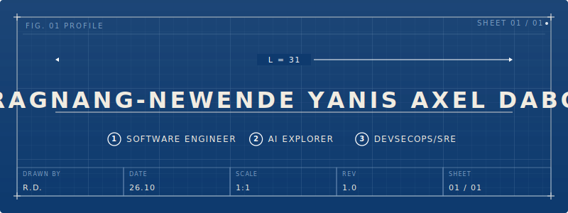

<div align="center">

</div>


<div align="center">
  
</div>

<br/>

[](https://user-badge.committers.top/burkina_faso_private/Y4NN777)

---

## Who I am

```yaml
name:      "Ragnang-Newende Yanis Axel DABO"
alias:     ">_TheY4NN"
code:      "Y4NN777" 
base:      "Ouagadougou, Burkina Faso"
mission:   "Learn & Build to Serve"

trajectory: >
  Software Engineer who designs systems,learns to builds them right,
  ships software applications, keeps them alive and reliable while driving their evolution.

philosophy: >
  "Code is a liability. Logic is an asset.
   Design before you code. Think before you write."

convictions:
  - "A requirement not verified is a bug waiting to be born"
  - "Clean code is a love letter to your future self and teammates"
  - "Build systems that can handle your success"

status:    "Stepping up. Shipping serious stuff."
```

---

## What I build with

<div align="center">


</div>

---

## Current Active work

| Project | What it is | Stack |
|---|---|---|
| [**mishkan-cc-harness**](https://github.com/Y4NN777/mishkan-cc-harness) | Personal SDLC harness — 45 agents, 6 teams, knowledge graph, observability, 18 workflows | Python · JS · Shell · Docker |
| [**7review**](https://github.com/Y4NN777/7review) | Strict code review agent for GitHub PRs & GitLab MRs — multi-LLM routing, human-in-the-loop | Go · Docker |
| [**doc-intel**](https://github.com/Y4NN777/doc-intel) | Terminal-native document intelligence — fully local, zero network calls, single Go binary | Go · FAISS · SQLite |
| [**TengLaafi**](https://github.com/Y4NN777/tenglaafi) | RAG medical assistant for tropical diseases & African medicinal plants — 1,531-doc corpus | Python · FastAPI · ChromaDB · Mistral-7B |
| [**WiseMoney**](https://github.com/Y4NN777/wisemoney) ↗ [live](https://wisemoney.y7labs.studio/) | Local-first finance PWA — encrypted on-device data, AI guidance, Go edge service, threat model | TypeScript · React ·Go · Docker |
| [**MalVision**](https://github.com/Y4NN777/MalVision) | Deep learning malware detection — binary visualization + CNN, classifies 25 malware families | Python · PyTorch |
| [**Y7-Jprompter**](https://github.com/Y4NN777/Y7-Jprompter) ↗ [live](https://y7-jprompter.y7labs.studio/) | Natural language → structured JSON via Gemini AI | JavaScript · Next.js |

---

## Stats

<div align="center">
  
  <br/><br/>
  
  
</div>

---

## Beyond the code

Bible reader · FIFA legend · Rap lyricist · Sound engineer  
*Faith, bars, and frequencies — the other stack.*

---

## Let's connect

<div align="center">
  <a href="https://www.linkedin.com/in/y4nnthedev777">
    
  </a>
  &nbsp;
  <a href="mailto:y4nn.dev@gmail.com">
    
  </a>
  &nbsp;
  <a href="https://www.y4nn.dev">
    
  </a>
</div>

---

<div align="center">

> *"I build to serve higher purpose."*

**~TheY4NN**


</div>
